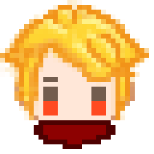

#  CSC-245 Final Project
Winter 17 class project

## Sources
- Buttons: https://pythonprogramming.net/pygame-python-3-part-1-intro/
## Dev Notes
- Pycharm will claim that it can't find modules even if it runs. To resolve this
right click on src folder>"Mark Directory As">"Sources Root"

- Uncomment the import statement in main_game and then run it to see the battle demo.

## Todo
- Have beta version ready for March 6th

### World Editor
- Good enough, no more required
- [ ] (optional) Saving/loading during full screen crashes -> Create popup dialog
    - Create list of available worlds
- [ ] (optional) Make wold size editable in game
- [ ] Place impassible tiles (with some visual indication)

### Main Game
- [x] Create menu to choose between editor and campaign
- [x] Make world zoomable (caleb, matt)

#### Campaign
- [ ] Create Demo (Matt, Josh)
    - [ ] Restrict user movement
    - [ ] Enter battle demo
- [ ] Create animation (Monica)
- [ ] (Optional) Create FOW

#### Battle
- [x] Basic Demo (Caleb)
    - [x] Add abilities functionality
    - [x] Add non-arbitrary player placement
    - [x] Add more players to each team
    - [ ] Animations
        - [ ] Melee
        - [ ] Projectile
        - [ ] Effects? (death, non-offensive ability use, melee animations, collision anims)
    - [ ] Buffs?

### Other
- [ ] Make executable (matt)
- [ ] (Optional) Add version number to menu
- [ ] (Optional) Add Credits